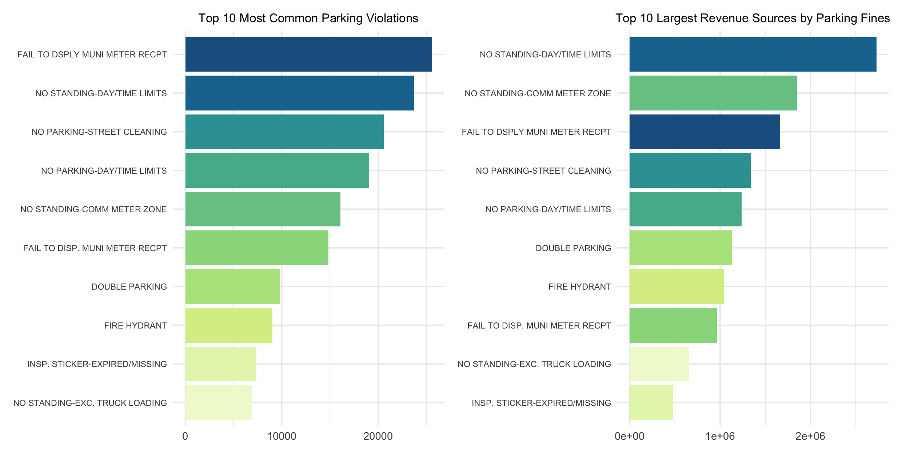
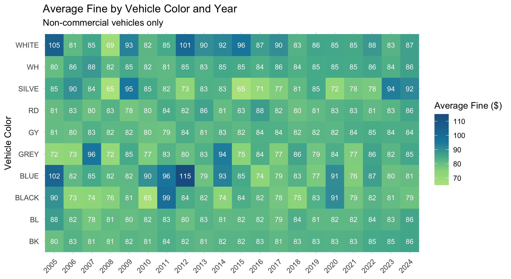

# GIS Mapping — NYC Parking Violations

## Overview

This project explores parking violation data from NYC Open Data, focusing on over 200,000 tickets issued in Manhattan during January 2025. The analysis combines tabular data exploration with geospatial visualization to reveal patterns in violation types, fine revenue, and geographic distribution across police precincts. The project also includes geocoding and interactive mapping of fire hydrant violations on the Upper East Side.

## Key Visualizations

| Topic | Chart Types |
|---|---|
| **Top violations & revenue** | Horizontal bar charts comparing frequency vs. revenue |
| **Fines by vehicle color & year** | Heatmap with annotated average fines |
| **Violations by precinct** | Choropleth maps (ticket count, total revenue, average fine) |
| **Fire hydrant violations** | Interactive Leaflet map with geocoded markers and clustering |
| **Luxury vs. non-luxury cars** | Color-coded circle markers with legend |

  

  

## Tools & Libraries

- **R** — ggplot2, dplyr, tidyverse, patchwork, RColorBrewer, readxl
- **Geospatial** — sf (shapefiles), leaflet (interactive maps), ggmap (geocoding)
- **Interactive** — DT (DataTables)

## Files

| File | Description |
|---|---|
| `assignment2_parking.qmd` | Quarto document with full analysis and visualizations |
| `ParkingViolationCodes_January2020.xlsx` | Violation code dictionary with fine amounts |
| `nypp_25a_shapefiles/` | NYPD precinct shapefiles for choropleth mapping |
| `Output/` | Exported visualization images |

## Data Sources

- [NYC Open Data — Parking Violations Issued](https://data.cityofnewyork.us/City-Government/Parking-Violations-Issued-Fiscal-Year-2021/pvqr-7yc4) (subset: Manhattan, January 2025)
- [NYC Planning — Police Precinct Shapefiles](https://www1.nyc.gov/site/planning/data-maps/open-data/districts-download-metadata.page)
