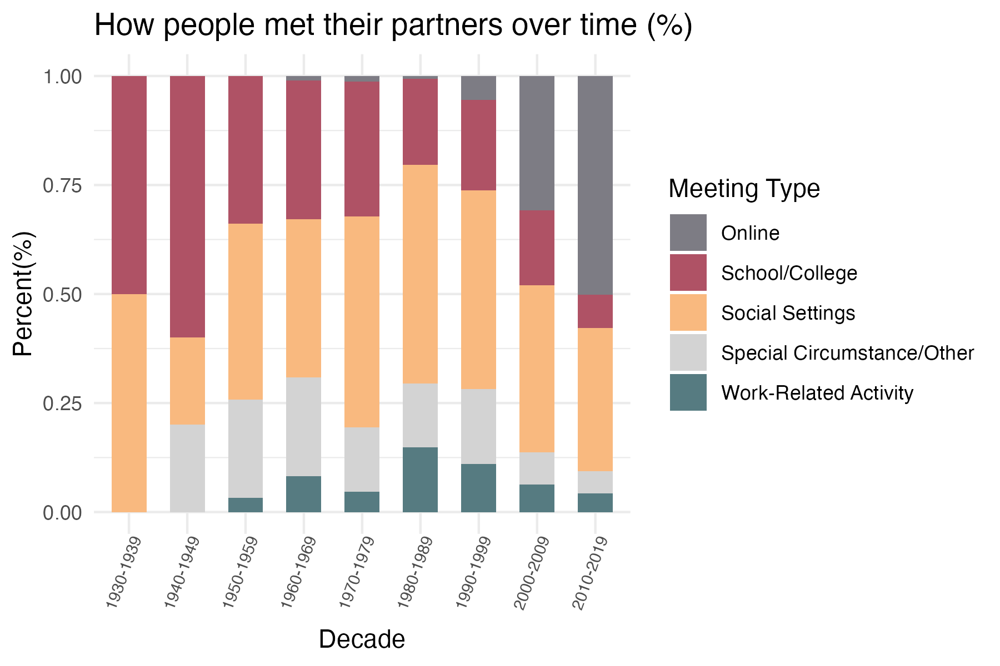
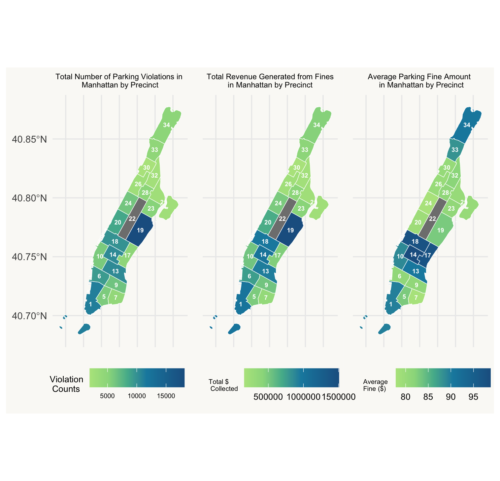
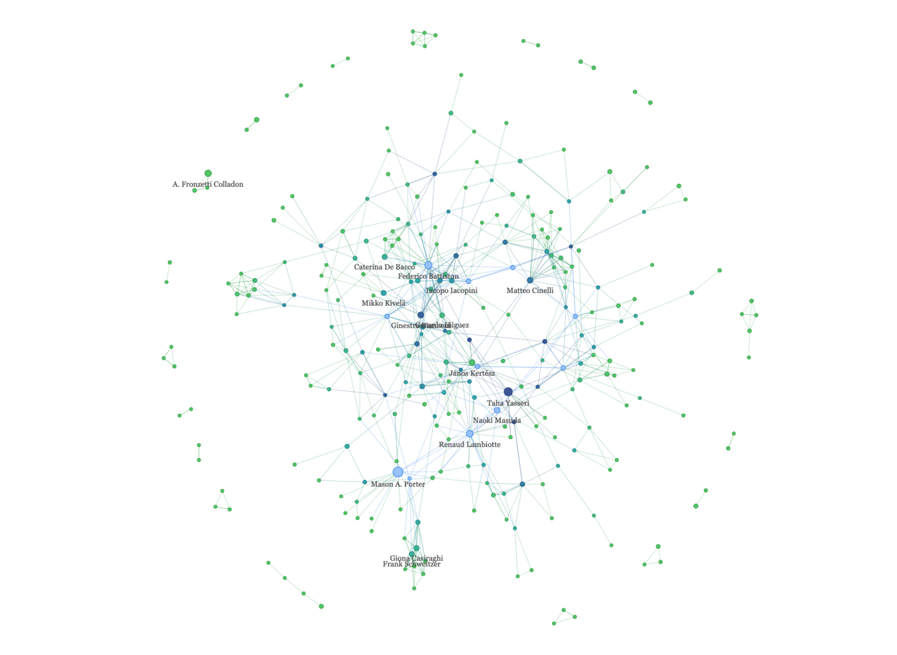

# Data Visualization Projects

## About

A collection of data visualization projects by **Sevastian Sanchez**, demonstrating skills in exploratory data analysis, geospatial mapping, text mining, and network analysis — all built in R. These projects were completed as part of the QMSS Data Visualization course, teaching a range of analytical and visual storytelling techniques. Each project folder contains the source code (R Markdown / Quarto), data files, and output visualizations.

---

## Projects

### 1. [Descriptive Statistics — Dating Trends](DescriptiveStats_Dating_L1/)

Analyzed the *How Couples Meet and Stay Together* (HCMST) survey from Stanford University to uncover patterns in how couples meet, the role of age and gender, and the influence of political affiliation on relationships.

**Highlights:** Stacked bar charts, scatter plots with regression, box plots, interactive pie charts (Plotly), and an interactive data table.

**Tools:** R · ggplot2 · dplyr · plotly · DT · patchwork

    

---

### 2. [GIS Mapping — NYC Parking Violations](GIS_NYC_Parking_L2/)

Explored over 200,000 parking violations issued in Manhattan (January 2025) using geospatial analysis. Created choropleth maps of violation counts, fine revenue, and average fines by police precinct, plus interactive Leaflet maps with geocoded fire hydrant violations.

**Highlights:** Choropleth maps, heatmaps, bar chart comparisons, interactive Leaflet maps with marker clustering, and geocoded address mapping.

**Tools:** R · ggplot2 · sf · leaflet · ggmap · RColorBrewer · patchwork

  

---

### 3. [Text & Network Analysis — arXiv Papers](Text+NetworkAnalysis_Arxiv_L3/)

Performed text mining and co-authorship network analysis on ~10,000 arXiv papers from the *Physics and Society* category (2018–2023). Identified top terms via frequency analysis and word clouds, and built an interactive author collaboration network.

**Highlights:** Term frequency bar charts, year-over-year word comparisons, word clouds, and an interactive co-authorship network graph (visNetwork).

**Tools:** R · tidytext · igraph · visNetwork · wordcloud · ggplot2

    

---
