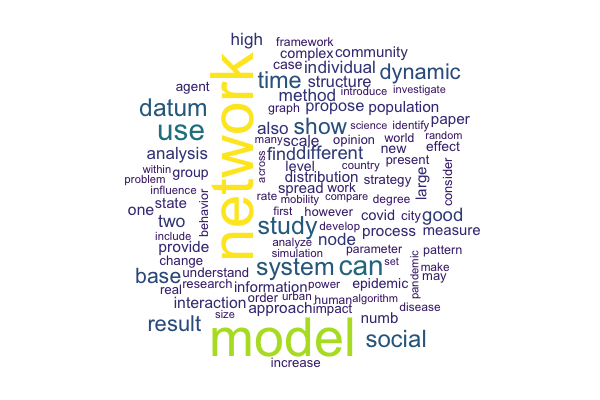

# Text & Network Analysis — arXiv Papers

## Overview

This project performs text mining and network analysis on approximately 10,000 arXiv papers from the *Physics and Society* (physics.soc-ph) category, published between 2018 and 2023. The analysis is divided into two parts:

1. **Text Analysis** — Term frequency analysis of paper abstracts, including year-over-year comparisons and word cloud generation.
2. **Network Analysis** — Construction and visualization of an author co-authorship network for papers that span both Physics and Society and Social/Information Networks categories.

## Key Visualizations

| Topic | Chart Types |
|---|---|
| **Top 20 terms across all abstracts** | Horizontal bar chart with gradient fill |
| **Term comparison: 2019 vs. 2023** | Grouped (dodged) bar chart |
| **Word cloud** | Top 100 terms with viridis color encoding |
| **Co-authorship network** | Interactive network graph (visNetwork) with centrality coloring and node sizing |

    

## Tools & Libraries

- **R** — tidyverse, ggplot2, lubridate
- **Text Mining** — tidytext, textstem, wordcloud
- **Network Analysis** — igraph, visNetwork

## Files

| File | Description |
|---|---|
| `Assignment3.1_TextAnalysis.Rmd` | R Markdown with text analysis (term frequency, word cloud) |
| `Assignment3.2_network.Rmd` | R Markdown with co-authorship network construction and visualization |
| `figures`| Contains all visualizations produced for this project |
| `data/arxiv_subset.csv` | Dataset of ~10,000 arXiv paper records |
| `data/arxiv_subset.json` | Full JSON metadata including parsed author names |

## Data Source

[arXiv](https://arxiv.org/) — Open-access archive for scholarly articles in physics, mathematics, computer science, and related disciplines.
